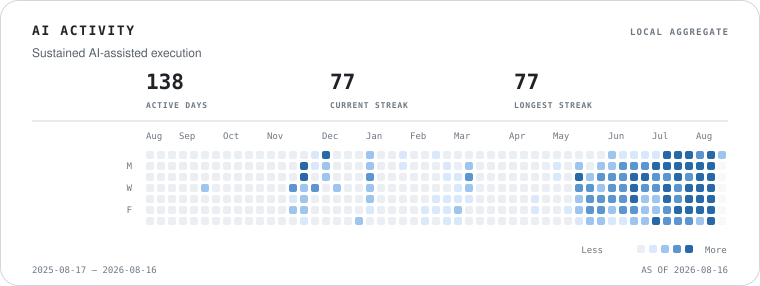
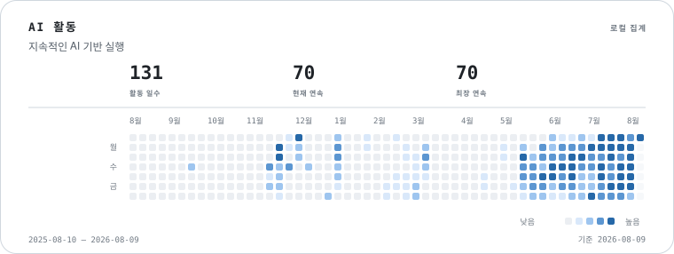

# Portfolio: Ju Woocheol

**Live:** [juuc.github.io/portfolio](https://juuc.github.io/portfolio/) · **GitHub:** [@juuc](https://github.com/juuc)

I rebuild fragile product platforms into systems that ship. At Bootalk, I moved from Data Engineer to Tech Lead / Product Owner, took over engineering ownership after the CTO transition, and turned AI-assisted development into an operating model for a small team.

## Impact Snapshot

| Output | Evidence |
|--------|----------|
| **Multi-role field operations integrated** | Connected assignment, evidence capture, review, and handover into an auditable DEV workflow with explicit release-evidence boundaries |
| **Commercial AI product delivered** | [SemuGPT](https://semugpt.co.kr) reached production handover and a signed commercial agreement on 2026-05-18 |
| **Platform rebuilt after CTO transition** | Led a 4-person engineering team across web, mobile, backend, data, releases, and deployments |
| **Frontend operating system unified** | 3 repos -> 1 monorepo; 1,417 authored PRs and 1,310 merged PRs in the frontend monorepo |
| **Search and performance unlocked** | CSR/static web -> SSR, sitemap 5 -> 48,706 URLs, [PageSpeed 20 -> 80](https://pagespeed.web.dev/analysis/https-bootalk-co-kr/4jic9i7it6?form_factor=desktop), Search Console clicks 3.9x and impressions 5.6x |
| **Production operations automated** | Sentry alert -> AI diagnosis -> fix PR pipeline for production issues |
| **AI-native execution scaled** | Fresh GitHub Search API / GraphQL counts as of 2026-08-16: 10,408 authored commits, 2,720 PRs, 2,532 merged PRs |

## AI Activity

Relative activity derived locally from coding-agent usage. The pattern is public; raw tokens, costs, sessions, and project details remain private.

<a href="https://juuc.github.io/portfolio/">
  <picture>
    <source media="(prefers-color-scheme: dark)" srcset="./public/metrics/ai-activity-dark-en.svg" />
    <source media="(prefers-color-scheme: light)" srcset="./public/metrics/ai-activity-light-en.svg" />
    
  </picture>
</a>

## Case Studies

| Case | Why It Matters |
|------|----------------|
| [Field Operations Platform Productization](en/projects/field-operations-platform.md) | Connected multiple roles, live state transitions, document review, and recovery into an integrated DEV operating path |
| [SemuGPT Commercialization](en/projects/semugpt-commercialization.md) | Prototype -> production handover -> signed commercial agreement for [semugpt.co.kr](https://semugpt.co.kr) |
| [Platform Rebuild](en/projects/platform-rebuild.md) | Took over a fragmented platform, then kept hardening production and rent/lease migration across frontend, backend, and data |
| [SEO & Performance Transformation](en/projects/seo-performance.md) | Made 48K+ listing pages indexable, raised [PageSpeed from 20 to 80](https://pagespeed.web.dev/analysis/https-bootalk-co-kr/4jic9i7it6?form_factor=desktop), and verified Search Console growth |
| [Autonomous Sentry Operations](en/projects/sentry-automation.md) | Replaced manual error triage with AI-operated diagnosis and PR generation |
| [Data Reliability Recovery](en/projects/data-reliability.md) | Turned script crawlers into scheduled Dagster data operations |

## Core Evidence

- [Overview](en/overview.md) — 90-second narrative and headline outputs
- [Selected Timeline](en/timeline.md) — only major milestones
- [Technical Evidence](en/architectural-decisions.md) — decisions that changed the platform
- [Operating Stack](en/skills.md) — skills mapped to outputs
- [Previous: Intelz / YouBook](en/intelz.md) — product and UX foundation before Bootalk

## 한국어

저는 취약한 제품 플랫폼을 실제로 배포되고 운영되는 시스템으로 바꾸는 엔지니어입니다. 부톡에서는 Data Engineer로 합류해 Tech Lead / Product Owner 역할까지 확장했고, CTO 전환 이후 웹, 앱, 백엔드, 데이터, 릴리스, 배포를 직접 책임졌습니다.

### 핵심 산출물

| 산출물 | 근거 |
|--------|------|
| **다역할 현장 운영 통합** | 배정, 증빙 수집, 검토, 인계를 추적 가능한 DEV 워크플로우로 연결하고 릴리스 증거 경계를 명시 |
| **상용 AI 제품 인수인계** | [세무GPT](https://semugpt.co.kr) 프로덕션 인수인계 및 2026-05-18 상용 계약 체결 |
| **CTO 전환 이후 플랫폼 재건** | 4인 개발팀을 이끌며 웹, 앱, 백엔드, 데이터, 배포 전반 소유 |
| **프론트엔드 운영체계 통합** | 3개 레포 -> 1개 모노레포; 프론트엔드 모노레포 작성 PR 1,417건, 머지 PR 1,310건 |
| **검색/성능 전환** | CSR/정적 웹 -> SSR, 사이트맵 5개 -> 48,706개 URL, [PageSpeed 20 -> 80](https://pagespeed.web.dev/analysis/https-bootalk-co-kr/4jic9i7it6?form_factor=desktop), Search Console 클릭 3.9배·노출 5.6배 |
| **프로덕션 운영 자동화** | Sentry 알림 -> AI 진단 -> 수정 PR 생성 파이프라인 |
| **AI 기반 실행력 확장** | 2026-08-16 기준 최신 GitHub Search API / GraphQL 집계: 작성 커밋 10,408건, PR 2,720건, 머지 PR 2,532건 |

### AI 활동

코딩 에이전트 사용량을 로컬에서 상대 강도로 변환했습니다. 활동 패턴만 공개하며 원본 토큰, 비용, 세션, 프로젝트 정보는 비공개로 유지합니다.

<a href="https://juuc.github.io/portfolio/">
  <picture>
    <source media="(prefers-color-scheme: dark)" srcset="./public/metrics/ai-activity-dark-ko.svg" />
    <source media="(prefers-color-scheme: light)" srcset="./public/metrics/ai-activity-light-ko.svg" />
    
  </picture>
</a>

### 케이스 스터디

| 케이스 | 의미 |
|--------|------|
| [현장 운영 플랫폼 제품화](ko/projects/field-operations-platform.md) | 여러 역할, 실제 상태 전환, 문서 검토, 복구를 통합 DEV 운영 경로로 연결 |
| [세무GPT 상용화](ko/projects/semugpt-commercialization.md) | 프로토타입 -> 프로덕션 인수인계 -> [semugpt.co.kr](https://semugpt.co.kr) 상용 계약 체결 |
| [플랫폼 재건](ko/projects/platform-rebuild.md) | 분산된 플랫폼을 작은 팀이 운영 가능한 구조로 재정비한 뒤, 프론트엔드·백엔드·데이터 전반의 프로덕션 하드닝과 전월세 마이그레이션까지 이어감 |
| [SEO & 성능 전환](ko/projects/seo-performance.md) | 48K+ 매물 페이지 색인화, [PageSpeed 20 -> 80](https://pagespeed.web.dev/analysis/https-bootalk-co-kr/4jic9i7it6?form_factor=desktop), Search Console 성장 검증 |
| [자율 Sentry 운영](ko/projects/sentry-automation.md) | 수동 에러 분석을 AI 진단/PR 생성 파이프라인으로 대체 |
| [데이터 신뢰성 복구](ko/projects/data-reliability.md) | 스크립트형 크롤러를 Dagster 기반 데이터 운영으로 전환 |

### 근거 문서

- [개요](ko/overview.md)
- [선별 타임라인](ko/timeline.md)
- [기술적 근거](ko/architectural-decisions.md)
- [운영 스택](ko/skills.md)
- [이전 경력: Intelz / YouBook](ko/intelz.md)
